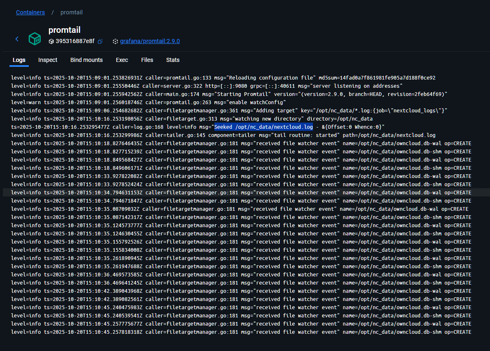

# Лабораторная работа №2: Loki + Zabbix + Grafana

## Цель работы
Подключить к тестовому сервису Nextcloud систему мониторинга и логирования с последующей визуализацией через Grafana.

## Ход работы

### Часть 1. Логирование

1. Создан docker-compose.yml файл, содержащий необходимые сервисы:
   - Nextcloud
   - Loki
   - Promtail
   - Grafana
   - Zabbix
   - PostgreSQL

2. Создан конфигурационный файл promtail_config.yml для настройки сбора логов.

3. После запуска docker-compose была выполнена инициализация Nextcloud через веб-интерфейс:

4. Проверка работы Promtail показала успешное подключение к лог-файлам:

### Часть 2. Мониторинг

1. Выполнена настройка Zabbix через веб-интерфейс (http://localhost:8082).

2. Импортирован кастомный шаблон для мониторинга Nextcloud.

3. Настроена коммуникация между Zabbix и Nextcloud через добавление trusted_domains.

4. Создан и настроен хост для мониторинга Nextcloud с подключением тестового шаблона.

5. Проверена работа мониторинга через включение/выключение режима обслуживания:

### Часть 3. Визуализация

1. Установлен плагин Zabbix для Grafana.

2. Настроены источники данных:
   - Loki с адресом http://loki:3100
   - Zabbix с адресом http://zabbix-front:8080/api_jsonrpc.php

3. Созданы дашборды для визуализации данных:
   - Мониторинг статуса Nextcloud через Zabbix
   - Отображение логов через Loki

### Работа с запросами и создание дашбордов

#### Эксперименты с запросами

1. Для Loki были протестированы различные типы запросов:
   - Базовый запрос для просмотра всех логов: `{job="nextcloud_logs"}`
   - Фильтрация по уровню важности: `{job="nextcloud_logs"} |= "error"`
   - Поиск конкретных событий: `{job="nextcloud_logs"} |= "login" |= "successful"`
   - Агрегация логов по временным интервалам: `rate({job="nextcloud_logs"}[5m])`

2. Для Zabbix исследованы следующие метрики:
   - Статус доступности сервиса
   - Время отклика
   - Количество активных пользователей
   - Использование системных ресурсов

#### Создание дашбордов

1. Дашборд мониторинга Nextcloud (Zabbix):
   - Добавлена панель статуса сервиса в виде цветной плашки
   - Настроены пороговые значения:
     * Зеленый: сервис работает нормально
     * Желтый: предупреждение (high latency)
     * Красный: сервис недоступен
   - Добавлены всплывающие подсказки с детальной информацией

2. Дашборд логов (Loki):
   - Создана таблица с основными полями:
     * Timestamp
     * Log Level
     * Message
     * Source
   - Настроена фильтрация по уровням логирования
   - Добавлен поиск по содержимому логов
   - Настроена автоматическая обновление данных каждые 5 минут

[Здесь будут добавлены скриншоты финальных дашбордов]

## Ответы на вопросы

### 1. Чем SLO отличается от SLA?

SLA (Service Level Agreement) - это формальное соглашение между поставщиком услуг и клиентом, определяющее уровень обслуживания, включая метрики, обязательства и последствия невыполнения условий.

SLO (Service Level Objective) - это конкретные метрики и цели внутри SLA, которые поставщик услуг стремится достичь. Например, доступность сервиса 99.9% времени или время отклика менее 200 мс.

### 2. Чем отличается инкрементальный бэкап от дифференциального?

**Инкрементальный бэкап:**
- Сохраняет только изменения, произошедшие после последнего бэкапа (любого типа)
- Для восстановления нужны все инкрементальные копии после последнего полного бэкапа
- Занимает меньше места, но восстановление сложнее

**Дифференциальный бэкап:**
- Сохраняет все изменения после последнего полного бэкапа
- Для восстановления нужен только последний полный бэкап и последний дифференциальный
- Занимает больше места, но восстановление проще

### 3. В чем разница между мониторингом и observability?

**Мониторинг:**
- Фокусируется на сборе и анализе предопределенных метрик
- Отвечает на известные вопросы "что случилось?"
- Используется для отслеживания заранее известных проблем

**Observability (наблюдаемость):**
- Позволяет исследовать поведение системы, даже если проблема неизвестна
- Комбинирует логи, метрики и трейсы для полного понимания системы
- Отвечает на вопрос "почему это случилось?"
- Помогает обнаруживать неожиданные проблемы и их причины

## Вывод

В ходе лабораторной работы была успешно настроена система мониторинга и логирования для сервиса Nextcloud с использованием стека Loki + Zabbix + Grafana. Реализована визуализация данных через дашборды Grafana, что позволяет эффективно отслеживать состояние сервиса и анализировать логи.